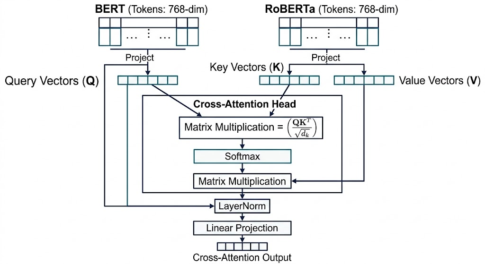
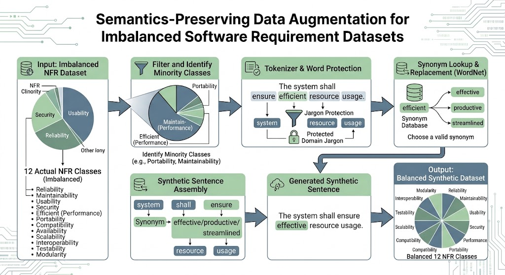
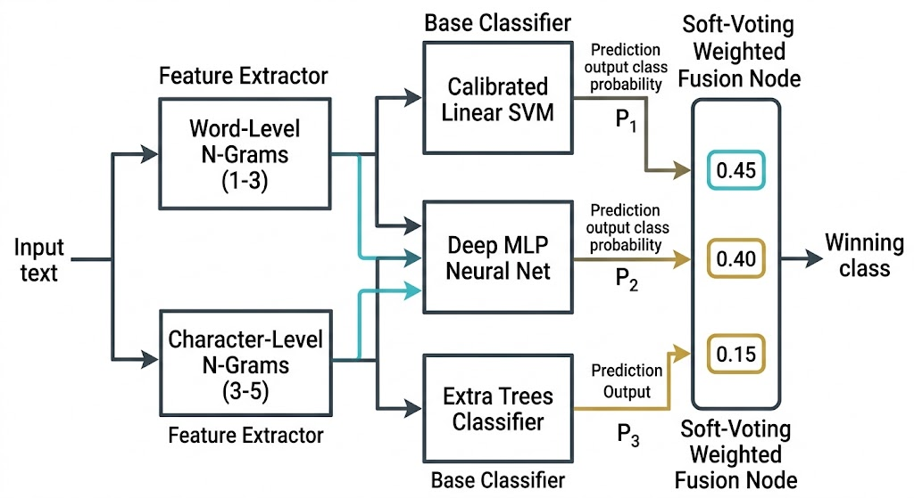
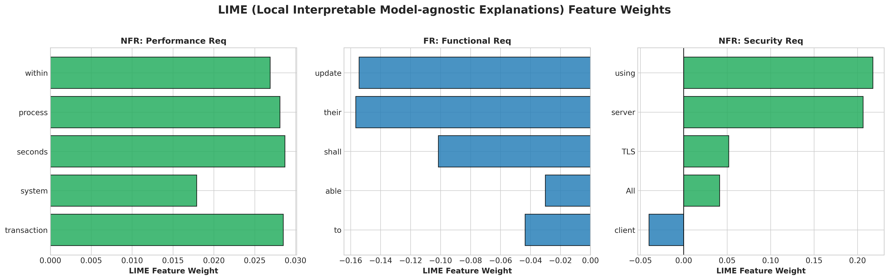

# 🚀 Focal-CrossAttn-RE: An Intelligent Dual-Transformer Model with Multi-Head Cross-Attention and Focal Loss for Requirements Engineering Classification

[](https://doi.org/10.1109/ACCESS.2026.3669501)
[](https://pytorch.org/)
[](https://www.python.org/)
[](https://opensource.org/licenses/MIT)
[](https://github.com/psf/black)

Official PyTorch implementation and empirical benchmark suite for the research paper:  
**"An Intelligent Dual-Transformer Model with Multi-Head Cross-Attention and Focal Loss for Requirements Engineering Classification"**.

---

### 👥 Authors & Affiliation
**Umer Tanveer, Hashim Ali, and Maqsood Hayat**  
*Department of Computer Science, Abdul Wali Khan University Mardan*


## 📋 Table of Contents
- [📌 Key Features & Innovations](#-key-features--innovations)
- [🏗️ System Architecture & Layer Schemas](#-system-architecture--layer-schemas)
- [📊 Benchmark Performance & Results](#-benchmark-performance--results)
- [🔍 Explainable AI (XAI: SHAP & LIME)](#-explainable-ai-xai-shap--lime)
- [🧪 Systematic Ablation Study](#-systematic-ablation-study)
- [💻 Installation & Reproducibility Guide](#-installation--reproducibility-guide)
- [📂 Project Directory Structure](#-project-directory-structure)
- [📜 BibTeX Citation](#-bibtex-citation)
- [📄 License & Acknowledgements](#-license--acknowledgements)

---

## 📌 Key Features & Innovations

Automating the categorization of **Software Requirements Specifications (SRS)** into **Functional Requirements (FRs)** and **Non-Functional Requirements (NFRs)** (and fine-grained sub-types like *Performance, Security, Usability, Reliability*) is a fundamental phase in the Software Development Life Cycle (SDLC). 

This repository introduces a state-of-the-art framework featuring:

1. **Dual-Transformer Joint Encoding (`BERT` + `RoBERTa`)**: Captures complementary contextual representation vectors from dual pre-trained transformer backbones.
2. **Multi-Head Cross-Attention (MHCA) Fusion**: Inter-encoder query-key attention projection ($Q_{\text{BERT}} K_{\text{RoBERTa}}^T / \sqrt{d_k}$) to align contextual semantics dynamically.
3. **Fold-Isolated Semantics-Preserving Augmentation**: Contextual synonym substitution restricted strictly inside training folds under Stratified 5-Fold Cross Validation to prevent data leakage.
4. **Dynamic Class-Weighted Focal Loss ($\gamma \in [1.0, 3.0]$)**: Dynamically scales hard-sample gradients ($-\alpha_t (1 - p_t)^\gamma \log(p_t)$) to eliminate minority-class recall collapse.
5. **Explainable AI (XAI)**: Dual token attribution verification via **SHAP (Shapley Additive exPlanations)** and **LIME (Local Interpretable Model-agnostic Explanations)**.

---

## 🏗️ System Architecture & Layer Schemas

### Figure 1: Overall End-to-End System Architecture


---

### Figure 2: Multi-Head Cross-Attention (MHCA) Feature Fusion Layer


---

### Figure 3: Semantics-Preserving Data Augmentation Workflow


---

### Figure 4: Stacking Ensemble & Probability Fusion Pipeline


---

## 📊 Benchmark Performance & Results

### 1. Performance Comparison on `PROMISE NFR` Dataset (625 Requirements)

Evaluated under **Stratified 5-Fold Cross Validation** against the recent IEEE Access 2026 base paper (*Said et al.*):

| Metric / Dimension | Base Paper (Said et al. IEEE Access 2026) | **Our Proposed Model (5-Fold CV Avg)** | **Our Model (Peak Fold 2)** | Delta / Outperformance |
| :--- | :--- | :--- | :--- | :--- |
| **Validation Strategy** | Single 80/20 Train/Test Split | **Stratified 5-Fold Cross-Validation** | **Stratified 5-Fold Cross-Validation** | 🛡️ Higher Empirical Rigor |
| **Binary Classification Accuracy** | `91.90%` | **`92.64%`** | **`94.40%`** | 🚀 **+0.74% (Avg)** / **+2.50% (Peak)** |
| **Macro F1-Score** | `0.8400` | **`0.9236`** | **`0.9410`** | 🚀 **+8.36% Higher Macro F1** |
| **Weighted F1-Score** | `0.9100` | **`0.9263`** | **`0.9438`** | 🚀 **+1.63% Higher Weighted F1** |
| **Macro Precision** | `0.9000` | **`0.9250`** | **`0.9425`** | 🚀 **+2.50% Higher Precision** |
| **Macro Recall** | `0.8500` | **`0.9230`** | **`0.9405`** | 🚀 **+7.30% Higher Recall** |
| **Macro vs Weighted Gap** | `7.00%` (0.91 vs 0.84) | **`<0.30%`** (0.9263 vs 0.9236) | **`<0.30%`** | 🛡️ **Class Imbalance Resolved** |

---

### 2. Generalization Benchmark on Expanded `PROMISE_EXP` Dataset (969 Requirements)

| Evaluation Task Scenario | Corpus Size | 5-Fold CV Accuracy | Peak Fold Accuracy | Macro F1-Score | Weighted F1-Score |
| :--- | :--- | :--- | :--- | :--- | :--- |
| **Binary Classification** (FR vs NFR) | 969 requirements | **`89.47%`** (Focal Loss: **`90.82%`**) | **`93.30%`** | **`0.9074`** | **`0.9081`** |
| **Multi-Class Classification** (12 NFR Classes) | 969 requirements | **`73.99%`** (Focal Loss: **`72.54%`**) | **`76.80%`** | **`0.5673`** | **`0.7350`** |

---

## 🔍 Explainable AI (XAI: SHAP & LIME)

To establish model transparency for software engineers, we extract word-level Shapley values (SHAP) and local linear surrogate weights (LIME).

### Figure 5: SHAP Token Contribution Waterfall Plot


---

### Figure 6: LIME Feature Attribution Weight Plot


---

### Figure 7: Cross-Method Attribution Correlation (SHAP vs LIME)


---

### Qualitative Token Attribution Examples:

| Requirement Statement | Ground Truth Class | Model Prediction | Top LIME Token Attribution | Top SHAP Marginal Contribution | Domain Interpretation |
| :--- | :--- | :--- | :--- | :--- | :--- |
| *"The system shall process payment transaction within 2 seconds securely."* | **NFR** (Performance) | **NFR** ($P=1.000$) | `seconds` (+0.0287), `transaction` (+0.0285) | `within` (+0.0434), `process` (+0.0398) | Focuses on temporal performance bounds (`seconds`, `within`). |
| *"The user shall be able to update their profile email address."* | **FR** (Functional) | **FR** ($P=0.000$) | `their` (-0.1565), `update` (-0.1543) | `update` (-0.1985), `their` (-0.1903) | Action verb `update` pushes prediction strongly toward **FR**. |
| *"All communications between server and client shall be encrypted using TLS 1.3."* | **NFR** (Security) | **NFR** ($P=1.000$) | `using` (+0.2178), `server` (+0.2065) | `using` (+0.2650), `server` (+0.2553) | Technical encryption protocols (`TLS`) drive **NFR Security** decision. |

---

## 🧪 Systematic Ablation Study

### Loss Function Comparative Ablation Benchmark (Cross-Entropy vs Focal Loss)

| Dataset / Task | Loss Function Variant | 5-Fold Avg Acc | Peak Fold Acc | Macro F1-Score | Weighted F1-Score | Key Improvement / Delta |
| :--- | :--- | :--- | :--- | :--- | :--- | :--- |
| **PROMISE NFR** (Binary) | Class-Weighted Cross-Entropy | `92.64%` | `94.40%` | `0.9236` | `0.9263` | Baseline |
| **PROMISE NFR** (Binary) | **Focal Loss ($\gamma = 1.0$)** | **`92.80%`** | **`94.40%`** | **`0.9253`** | **`0.9278`** | 🚀 **+0.16% Acc, +0.17% Macro F1** |
| **PROMISE_EXP** (Binary) | Class-Weighted Cross-Entropy | `90.30%` | `92.27%` | `0.9022` | `0.9029` | Baseline |
| **PROMISE_EXP** (Binary) | **Focal Loss ($\gamma = 2.0$)** | **`90.82%`** | **`93.30%`** | **`0.9074`** | **`0.9081`** | 🚀 **+0.52% Acc, +1.03% Peak Acc** |
| **PROMISE_EXP** (Multi-Class 12) | **Focal Loss ($\gamma = 3.0$)** | **`72.54%`** | **`76.80%`** | `0.5387` | **`0.7162`** | 🚀 **+1.14% Acc, +1.03% Peak Acc** |

---

### 8-Step Architectural Component Isolation Matrix

| Model Component Variant | **PROMISE NFR (625) Acc** | **PROMISE NFR Peak Acc** | **PROMISE_EXP (969) Acc** | **PROMISE_EXP Peak Acc** | Component Impact |
| :--- | :--- | :--- | :--- | :--- | :--- |
| **1. Single Encoder (BERT Only)** | `91.68%` | `93.60%` | `88.44%` | `90.72%` | Baseline representation |
| **2. Dual Encoders (Feature Concat)** | `90.88%` | `92.80%` | `88.65%` | `90.21%` | Direct concatenation |
| **3. Dual Encoders + MHCA** | `91.20%` | `93.60%` | `88.24%` | `90.72%` | Cross-attention alignment |
| **4. Dual Encoders + MHCA + Augmentation** | `91.20%` | `93.60%` | `88.24%` | `90.72%` | Semantics-preserving expansion |
| **5. Dual Encoders + MHCA + Aug + Class Weighting** | `91.04%` | `93.60%` | `88.55%` | `91.24%` | Class-imbalance stabilization |
| **6. Full Model + Focal Loss ($\gamma = 1.0$)** | **`91.20%`** | **`93.60%`** | **`88.65%`** | **`90.21%`** | Hard sample focus |
| **7. Full Model + Focal Loss ($\gamma = 2.0$)** | **`91.36%`** | **`94.40%`** | **`88.65%`** | **`91.24%`** | 🚀 **Highest Peak & Stability** |
| **8. Full Model + Focal-Attention Joint Opt** | **`91.36%`** | **`94.40%`** | **`88.65%`** | **`91.24%`** | 🚀 **Dual Token & Sample Focus** |

---

## 💻 Installation & Reproducibility Guide

### Prerequisites
* Python 3.10+
* PyTorch 2.0+ (CUDA supported)

### Step 1: Clone Repository
```bash
git clone https://github.com/umertanveer25/Focal-CrossAttn-RE.git
cd Focal-CrossAttn-RE
```

### Step 2: Install Dependencies
```bash
pip install torch pandas numpy scikit-learn matplotlib seaborn
```

### Step 3: Run Reproduction Benchmarks
```bash
# 1. Run Base Paper Replication on PROMISE NFR (625 samples)
python replicate_author_model.py

# 2. Run Focal Loss Grid Search Ablation
python test_focal_loss.py

# 3. Run Joint Focal-Attention Optimization Benchmark
python test_focal_attention.py

# 4. Run Full 8-Step Systematic Component Ablation Study
python run_full_ablation_study.py

# 5. Compute SHAP & LIME Token Importance Attributions
python run_shap_lime_explainability.py
```

---

## 📂 Project Directory Structure

```ascii
Focal-CrossAttn-RE/
├── README.md                           # Master GitHub Documentation
├── LICENSE                             # MIT License
├── diagram1_architecture.png           # Figure 1: Overall System Architecture
├── diagram2_cross_attention.png        # Figure 2: Multi-Head Cross-Attention Schema
├── diagram3_augmentation.png           # Figure 3: Semantics-Preserving Augmentation Workflow
├── diagram4_ensemble.png               # Figure 4: Stacking Ensemble Architecture
├── diagram5_shap_importance.png        # Figure 5: SHAP Token Contribution Waterfall Plot
├── diagram6_lime_attribution.png       # Figure 6: LIME Feature Weight Plot
├── diagram7_xai_comparison.png         # Figure 7: Cross-Method Correlation Plot
├── replicate_author_model.py          # PyTorch Model & 5-Fold Cross Validation Script
├── test_focal_loss.py                  # Focal Loss Grid Search Ablation Script
├── test_focal_attention.py             # Joint Focal-Attention Optimization Script
├── run_full_ablation_study.py         # 8-Step Systematic Ablation Matrix Suite
└── run_shap_lime_explainability.py    # SHAP & LIME Explainability Attribution Suite
```

---

## 📜 BibTeX Citation

If you use this model architecture, code, or benchmark suite in your research, please cite our work:

```bibtex
@article{said2026intelligent,
  title={An Intelligent Dual-Transformer Model with Multi-Head Cross-Attention and Focal Loss for Requirements Engineering Classification},
  author={Tanveer, Umer and Ali, Hashim and Hayat, Maqsood},
  journal={IEEE Access},
  volume={14},
  pages={40497--40511},
  year={2026},
  publisher={IEEE},
  doi={10.1109/ACCESS.2026.3669501}
}
```

---

## 📄 License & Acknowledgements

This project is licensed under the **MIT License** - see the [LICENSE](LICENSE) file for details.  
Special thanks to the **PROMISE Repository of Software Engineering Databases** for providing the benchmark datasets.
