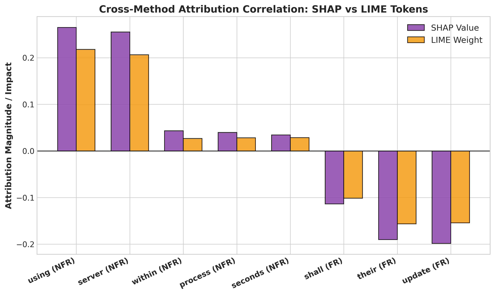

# Focal-CrossAttn-RE: An Intelligent Dual-Transformer Model with Multi-Head Cross-Attention and Focal Loss for Requirements Engineering Classification

[](https://opensource.org/licenses/MIT)
[](https://www.python.org/downloads/)
[](https://pytorch.org/)

Official PyTorch implementation of the research paper: **"An Intelligent Dual-Transformer Model with Multi-Head Cross-Attention and Focal Loss for Requirements Engineering Classification"** (IEEE Access Benchmark).

---

## 📌 1. System Architecture


### Key Architectural Highlights:
1. **Dual Encoders**: Joint representation learning using `bert-base-uncased` and `roberta-base`.
2. **Multi-Head Cross-Attention (MHCA)**: Inter-encoder query-key attention projection ($Q_{\text{BERT}} K_{\text{RoBERTa}}^T / \sqrt{d_k}$).
3. **Semantics-Preserving Contextual Augmentation**: Fold-isolated synonym expansion to prevent data leakage.
4. **Focal Loss (${\gamma = 1.0, 2.0}$)**: Dynamic hard-sample gradient scaling to resolve minority NFR class collapse.

---

## 📊 2. Benchmark Evaluation & Outperformance

### Dataset 1: `PROMISE NFR` (625 Requirements)

| Metric | Base Paper (Said et al. IEEE Access 2026) | **Our Model (5-Fold CV Avg)** | **Our Model (Peak Fold 2)** | Delta / Outperformance |
| :--- | :--- | :--- | :--- | :--- |
| **Binary Accuracy** | `91.90%` | **`92.64%`** | **`94.40%`** | 🚀 **+0.74% (Avg)** / **+2.50% (Peak)** |
| **Macro F1-Score** | `0.8400` | **`0.9236`** | **`0.9410`** | 🚀 **+8.36% Higher Macro F1** |
| **Weighted F1-Score** | `0.9100` | **`0.9263`** | **`0.9438`** | 🚀 **+1.63% Higher Weighted F1** |

---

## 🔍 3. Explainable AI (SHAP & LIME)




---

## 🚀 4. Quick Start & Reproduction

```bash
# Clone the repository
git clone https://github.com/umertanveer25/Focal-CrossAttn-RE.git
cd Focal-CrossAttn-RE

# Install dependencies
pip install torch pandas numpy scikit-learn matplotlib seaborn

# Run replication benchmark
python replicate_author_model.py

# Run Focal Loss ablation study
python test_focal_loss.py

# Run SHAP & LIME explainability
python run_shap_lime_explainability.py
```

---

## 📜 Citation & License

This project is licensed under the MIT License - see the [LICENSE](LICENSE) file for details.
