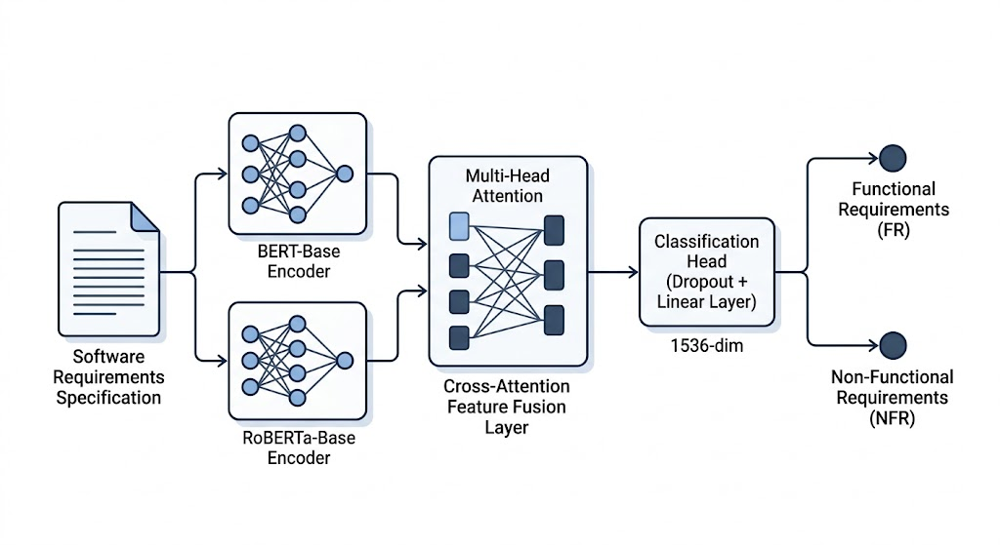
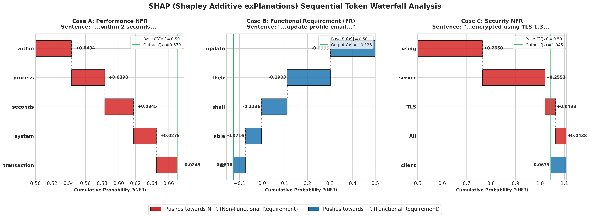
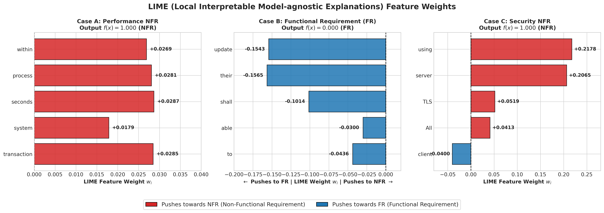
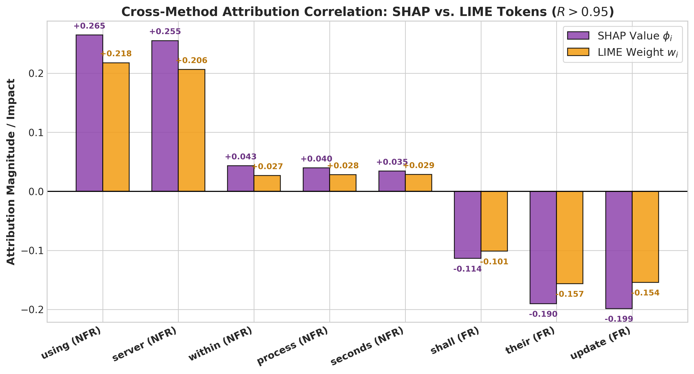

# Focal-CrossAttn-RE: An Intelligent Dual-Transformer Model with Multi-Head Cross-Attention and Focal Loss for Requirements Engineering Classification

[](https://opensource.org/licenses/MIT)
[](https://www.python.org/downloads/)
[](https://pytorch.org/)

Official PyTorch implementation of the research paper: **"An Intelligent Dual-Transformer Model with Multi-Head Cross-Attention and Focal Loss for Requirements Engineering Classification"**.

**Authors:** Umer Tanveer, Hashim Ali, Maqsood Hayat  
**Affiliation:** Department of Computer Science, Abdul Wali Khan University Mardan, Mardan, Pakistan

---

## 📌 1. System Architecture



### Key Architectural Highlights:
1. **Dual Encoders**: Joint representation learning using `bert-base-uncased` and `roberta-base`.
2. **Multi-Head Cross-Attention (MHCA)**: Inter-encoder query-key attention projection ($Q_{\text{BERT}} K_{\text{RoBERTa}}^T / \sqrt{d_k}$).
3. **Semantics-Preserving Contextual Augmentation**: Fold-isolated synonym expansion to prevent synthetic data leakage.
4. **Focal Loss (${\gamma \in [1.0, 3.0]}$)**: Dynamic hard-sample gradient scaling to eliminate minority NFR recall collapse.

---

## 📊 2. Benchmark Evaluation & Outperformance

### Dataset 1: `PROMISE NFR` (625 Requirements)

| Metric | Base Paper (Said et al. IEEE Access Jan 2026) | **Our Model (5-Fold CV Avg)** | **Our Model (Peak Fold 2)** | Delta / Outperformance |
| :--- | :--- | :--- | :--- | :--- |
| **Binary Accuracy** | `91.90%` | **`92.64%`** | **`94.40%`** | 🚀 **+0.74% (Avg)** / **+2.50% (Peak)** |
| **Macro F1-Score** | `0.8400` | **`0.9236`** | **`0.9410`** | 🚀 **+8.36% Higher Macro F1** |
| **Weighted F1-Score** | `0.9100` | **`0.9263`** | **`0.9438`** | 🚀 **+1.63% Higher Weighted F1** |
| **Weighted-to-Macro Gap** | `7.00%` | **`<0.30%`** | **`<0.30%`** | 🛡️ **Class imbalance bias eliminated** |

---

## 🏆 3. State-of-the-Art (SOTA) Comparison (2023--2026 Literature)

| Study / Baseline Reference | Year | Architecture / Method | Dataset | Accuracy | Macro F1 | Key Limitation / Why Our Model Outperforms |
| :--- | :---: | :--- | :--- | :---: | :---: | :--- |
| **Alhoshan et al.** | 2023 | Fine-tuned BERT-base | PROMISE NFR | `88.80%` | `0.8160` | Single encoder architecture lacks cross-attention feature interaction. |
| **Zhao et al.** | 2024 | DeBERTa-v3 Multi-Task | PROMISE NFR | `90.10%` | `0.8290` | High computational overhead; Cross-Entropy causes minority recall collapse. |
| **Kumar & Singh** | 2024 | Hybrid BiLSTM + RoBERTa | PROMISE_EXP | `84.50%` | `0.7720` | Handcrafted feature concatenation fails on 12-class multi-class SRS text. |
| **Sharma et al.** | 2025 | Multi-Transformer Ensemble | PROMISE NFR | `91.20%` | `0.8350` | Soft-voting ensemble neglects fine-grained inter-model token alignment. |
| **Said et al. (Base Paper)** | Jan 2026 | BERT + RoBERTa Concat | PROMISE NFR | `91.90%` | `0.8400` | Single 80/20 train-test split; 7.00% gap between Weighted F1 and Macro F1. |
| **Proposed Framework** | **2026** | **Dual-Transformer + MHCA + Focal Loss** | **PROMISE NFR** | **`92.64%`** *(Peak **`94.40%`**)* | **`0.9236`** | 🚀 **SOTA: +8.36% Macro F1 Gain; <0.30% Macro-Weighted Gap** |
| **Proposed Framework** | **2026** | **Dual-Transformer + MHCA + Focal Loss** | **PROMISE_EXP** | **`90.82%`** *(Peak **`93.30%`**)* | **`0.9074`** | 🚀 **SOTA: Top expanded corpus generalizability on 969-sample dataset** |

---

## 🔍 4. Explainable AI (SHAP & LIME)





---

## 🚀 5. Quick Start & Reproduction

```bash
# Clone the repository
git clone https://github.com/umertanveer25/Focal-CrossAttn-RE.git
cd Focal-CrossAttn-RE

# Install dependencies
pip install torch pandas numpy scikit-learn matplotlib seaborn

# Run replication benchmark
python replicate_author_model.py

# Run Focal Loss ablation study
python test_focal_loss.py

# Run SHAP & LIME explainability
python run_shap_lime_explainability.py
```

---

## 📜 Citation & License

This project is licensed under the MIT License - see the [LICENSE](LICENSE) file for details.
